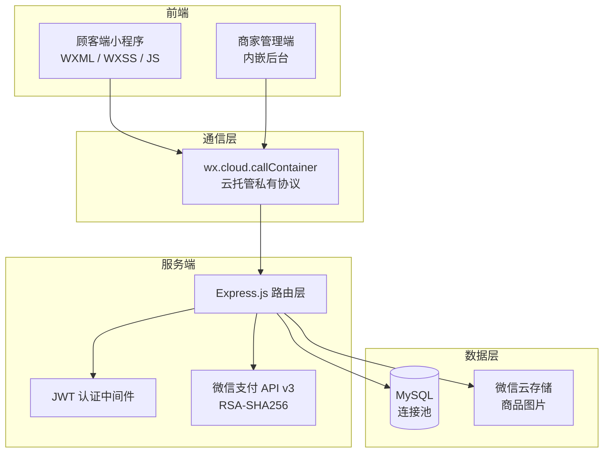
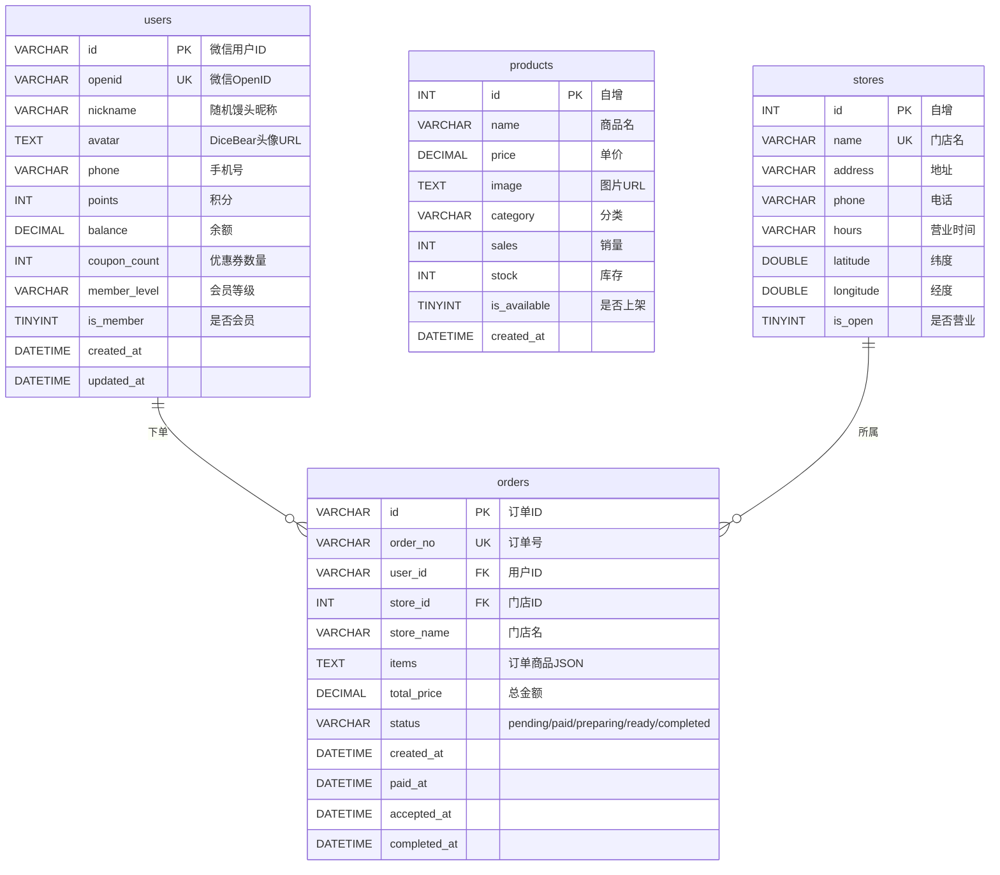

# 大力馒头 — 面包店扫码点单小程序

为珠海「大力馒头·信息港店」开发的全栈点单系统。顾客扫码下单，商家手机端实时接单，已在门店实际使用。

[](https://developers.weixin.qq.com/miniprogram/dev/framework/)
[](https://expressjs.com/)
[](https://www.mysql.com/)
[](https://jwt.io/)
[](https://pay.weixin.qq.com/)
[](https://cloud.weixin.qq.com/)
[](./LICENSE)

---

## 功能预览

### 顾客端

| 首页 | 门店选择（腾讯地图 + 距离计算） |
|:---:|:---:|
|  |  |

| 点单（分类 + 购物车） | 订单确认 + 支付 |
|:---:|:---:|
|  |  |

| 订单状态时间线 — 制作中 → 待取餐 |
|:---:|
| <table><tr><td width="50%"></td><td width="50%"></td></tr></table> |

| 订单列表（按状态筛选） | 个人中心 |
|:---:|:---:|
|  |  |

### 商家管理端

| 订单管理（状态筛选 + 实时轮询） | 商品管理（增删改 + 上下架） |
|:---:|:---:|
|  |  |

| 快速录单（线下收款记录） | 营收看板 |
|:---:|:---:|
|  |  |

### 完整流程演示

| 顾客下单全流程 | 商家接单处理 |
|:---:|:---:|
|  |  |

---

## 技术架构



---

## 数据库设计



---

## 业务流程

<table>
<tr>
<td width="50%" align="center"><b>顾客端</b></td>
<td width="50%" align="center"><b>商家端</b></td>
</tr>
<tr>
<td>门店选择 → 浏览商品 → 购物车 → 下单支付 → 订单跟踪</td>
<td>扫码/隐藏入口登录 → 订单管理 → 商品管理 → 快速录单 → 营收看板</td>
</tr>
</table>

---

## 技术栈

| 层级 | 技术选型 | 说明 |
|------|---------|------|
| 前端框架 | 微信小程序原生 | WXML 模板 + WXSS 样式 + JS 逻辑层 |
| 状态管理 | `getApp().globalData` | 轻量全局状态 |
| 网络通信 | `wx.cloud.callContainer` | 云托管私有协议，免域名备案 |
| 图片存储 | 微信云存储 | `wx.cloud.uploadFile` 直接上传 |
| 后端框架 | Express.js | RESTful API，6 个路由模块 |
| 数据库 | MySQL (mysql2) | 连接池 + 自动建表 + 兼容性列迁移 |
| 用户认证 | JWT | HS256，12 小时有效期 |
| 支付 | 微信支付 API v3 | RSA-SHA256 签名；商户号未开通时自动降级模拟支付 |
| 部署 | 微信云托管 | Docker 容器化 |

---

## 功能详情

### 顾客端（4 个 Tab）

- **首页** — Banner + 门店自提/邮寄服务入口 + 活动滚动区；连续点击 Banner 5 次进入商家后台
- **门店选择** — 腾讯地图标记门店位置，Haversine 公式实时计算距离，显示营业状态
- **点单页** — 左分类右商品经典布局，7 个分类筛选；底部悬浮购物车栏，加减数量、实时总价
- **订单确认** — 商品清单 + 金额汇总 + 微信支付（模拟降级模式）
- **订单详情** — 5 状态时间线：创建 → 支付 → 接单 → 制作完成 → 取餐，每步带时间戳
- **订单列表** — 状态 Tab 筛选，下拉刷新，支持再来一单
- **个人中心** — DiceBear 卡通头像 + 馒头主题昵称 + 积分/优惠券/余额资产卡片

### 商家端（小程序内嵌管理后台）

- **订单管理** — 按状态筛选全部订单，一键标记「可取餐」/「已完成」
- **实时轮询** — 递归 `setTimeout`，新订单自动刷新 + 手机震动提醒
- **商品管理** — 新增/编辑/上下架/删除商品，支持拍照上传图片
- **快速录单** — 线下收款直接录入系统，自动扣减库存、计入营收
- **营收看板** — 今日营收、订单总数、各状态分布一览

### 安全措施

- 商家 API 全部经由 JWT 中间件鉴权
- 密码、密钥、数据库凭据通过环境变量注入（`.env` 已 `.gitignore`）
- 登录过期自动清除 token 并跳转登录页

---

## 本地开发

```bash
# 1. 克隆仓库
git clone https://github.com/zip-Wu/tasty_bakery.git
cd tasty_bakery

# 2. 启动后端
cd backend
npm install
cp .env.example .env
# 编辑 .env，填入 ADMIN_PASSWORD、JWT_SECRET、DB_PASS 等
node seed.js    # 初始化数据库 + 种子数据
node app.js     # 启动 Express 服务

# 3. 启动前端
# 微信开发者工具 → 导入项目 → 选择 front_UI/ 目录
# project.config.json 中修改 appid 为你的小程序 AppID
```

---

## 项目结构

```
tasty_bakery/
├── front_UI/                   # 小程序前端（9 页面 + 1 组件）
│   ├── app.js                  # 应用入口 + 云托管 callContainer 封装
│   ├── app.json                # 页面路由 + 自定义 TabBar 配置
│   ├── config.js               # 云环境 ID 与服务名
│   ├── pages/
│   │   ├── home/               # 首页（Banner + 功能入口 + 活动区）
│   │   ├── store-select/       # 门店选择（腾讯地图 + Haversine 距离）
│   │   ├── index/              # 点单（分类筛选 + 购物车）
│   │   ├── order-confirm/      # 订单确认 + 支付
│   │   ├── order-detail/       # 5 状态时间线
│   │   ├── order-list/         # 订单列表（状态 Tab + 下拉刷新）
│   │   ├── logs/               # 个人中心
│   │   ├── admin/              # 商家管理（订单/商品/录单/营收）
│   │   └── auth/               # 商家登录
│   ├── custom-tab-bar/         # 自定义悬浮 TabBar 组件
│   └── images/                 # 静态图片资源
│
├── backend/                    # Node.js 后端
│   ├── app.js                  # Express 入口 + 路由挂载
│   ├── database.js             # MySQL 连接池 + 自动建表 + 列迁移
│   ├── seed.js                 # 种子数据（商品、门店）
│   ├── Dockerfile              # 云托管容器镜像
│   ├── .env.example            # 环境变量模板
│   ├── middleware/
│   │   └── auth.js             # JWT 认证中间件
│   ├── routes/
│   │   ├── auth.js             # 用户登录 / 个人信息
│   │   ├── menu.js             # 商品列表 / 分类
│   │   ├── orders.js           # 订单 CRUD / 支付
│   │   ├── store.js            # 门店列表（含距离计算）
│   │   ├── admin.js            # 商家管理 API
│   │   └── admin-auth.js       # 管理员登录
│   └── services/
│       └── wechat-pay.js       # 微信支付 API v3 封装
│
├── screenshots/                # 功能截图与演示 GIF
└── README.md
```

---

## 环境变量

仓库内不含任何真实密码或密钥，所有敏感信息通过 `.env` 注入（已 `.gitignore`）：

| 变量 | 用途 |
|------|------|
| `ADMIN_PASSWORD` | 商家管理后台密码 |
| `JWT_SECRET` | JWT 签名密钥 |
| `DB_PASS` | MySQL 密码 |
| `WX_PAY_*` | 微信支付商户凭证（商户号、私钥等） |
| `DB_HOST` / `DB_PORT` / `DB_NAME` | 数据库连接参数 |

模板文件：`backend/.env.example`

---

## License

MIT
