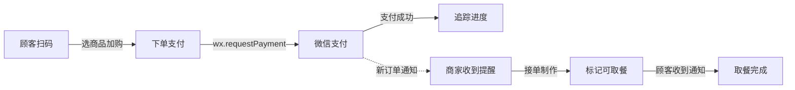
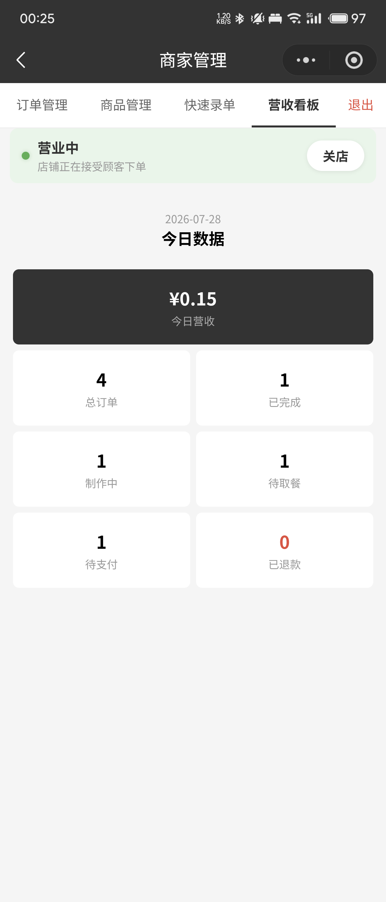
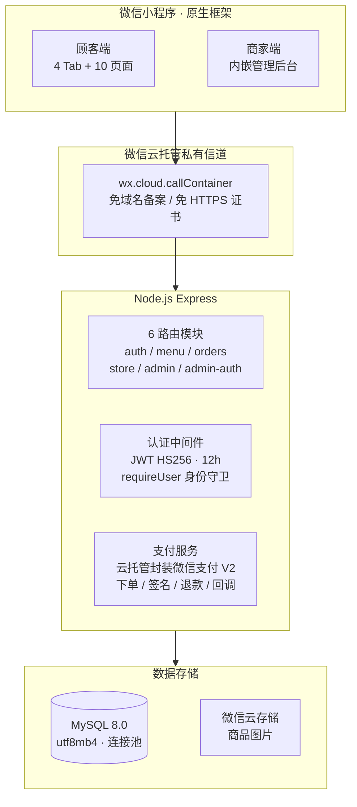
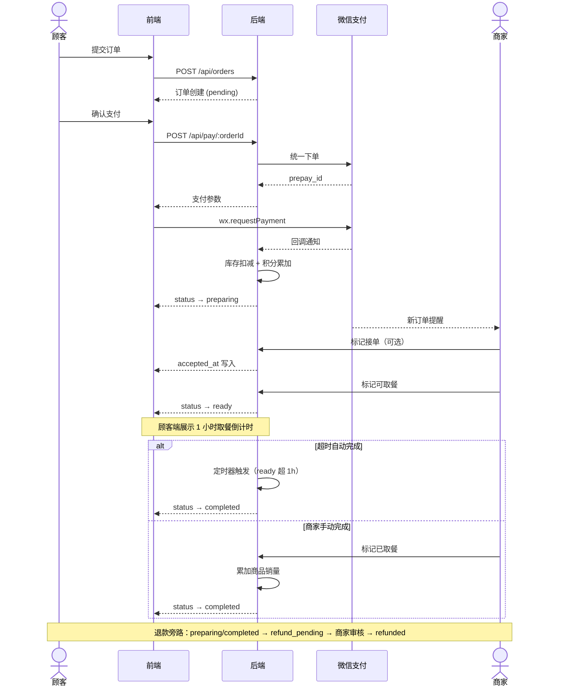
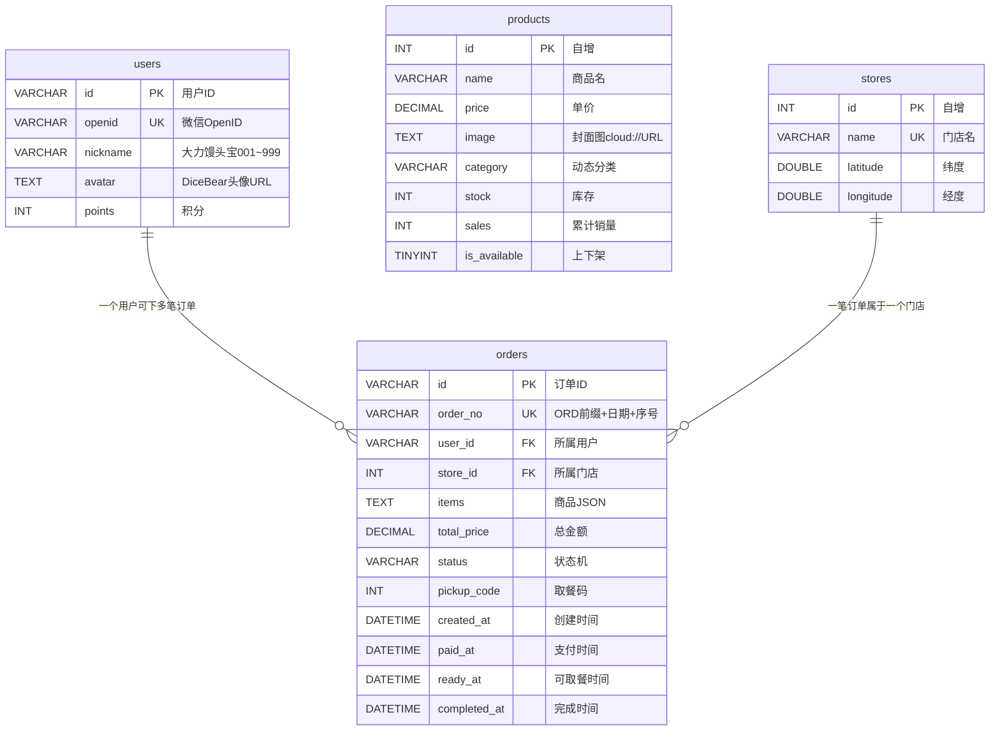

# 大力馒头铺 — 扫码点单小程序

> 覆盖完整的点单-支付-取餐流程，为珠海「大力馒头铺·信息港店」开发，已在门店实际使用。

[](https://developers.weixin.qq.com/miniprogram/dev/framework/)
[](https://expressjs.com/)
[](https://www.mysql.com/)
[](https://jwt.io/)
[](https://pay.weixin.qq.com/)
[](https://cloud.weixin.qq.com/)
[](./LICENSE)

---

## 快速了解

顾客扫描线下小程序码或搜索小程序进入，选商品加入购物车，微信支付下单，之后可以在订单详情页实时看到制作进度——从"制作中"到"可取餐"状态会随商家操作同步更新。

同一时间，商家手机会震动并播放提示音，提醒有新订单进来。商家做完后标记"可取餐"，顾客端立即收到通知。



---

## 功能一览

### 顾客端

| 功能 | 说明 |
|------|------|
| **门店选择** | 腾讯地图定位 + Haversine 公式计算球面距离，小于 1km 显示米、大于 1km 显示公里 |
| **商品浏览** | 左侧分类筛选（后端动态提取，非硬编码）、右侧商品列表，售罄商品灰显 |
| **购物车** | 页面级状态管理，切分类不丢数据，结算后自动清空 |
| **商品详情** | 轮播图 + 完整描述 + 月销量，支持从详情页直接加购 |
| **下单支付** | 订单确认后服务端按数据库真实价格重算总额，杜绝前端篡改；通过微信支付完成付款 |
| **订单追踪** | 4 步时间线（创建 → 制作 → 可取餐 → 完成），页面每 5 秒自动刷新状态 |
| **退款申请** | 已支付订单支持提交退款申请，商家审核批准后原路退回 |
| **个人中心** | DiceBear 自动头像 + "大力馒头宝001~999"顺序编号昵称 + 积分 |

### 商家端

| 功能 | 说明 |
|------|------|
| **实时订单提醒** | 新订单到达时手机震动 + 提示音（静音模式下也会响），顶部弹出"N 笔新订单"横幅 |
| **订单管理** | 状态筛选（全部/退款审核/制作中/待取餐/已完成/待支付/已退款），支持分页加载 |
| **退款审核** | 查看退款理由，批准 → 微信原路退款 + 回库存 + 退积分，拒绝 → 恢复原状态 |
| **商品管理** | 新增/编辑/上下架/删除，支持封面图及多图轮播上传至微信云存储，可调整排序 |
| **快速录单** | 线下现金收款专用，选好商品确认后自动生成 OFF 前缀订单号，直接完成并扣库存 |
| **营收看板** | 今日营收、订单总数、各状态分布，退款审核/制作中角标跨天常亮提醒 |
| **门店开关** | 一键打烊，顾客端立刻显示"已打烊"提示并拦住新下单 |

### 鉴权机制

顾客端和商家端采用两套独立的鉴权方案：

- **顾客端**：微信云托管网关在每次 API 请求中自动注入 `X-WX-OPENID` 头部，后端 `requireUser` 中间件根据 openid 查出该用户并挂载到 `req.user`。所有涉及用户数据的接口强制使用 `req.user.id` 而非客户端传入的 userId，防止横向越权（IDOR）。

- **商家端**：管理员密码登录后，后端签发 JWT（HS256 签名，12 小时有效）。之后每次 admin API 请求在 `Authorization` 头中携带 `Bearer <token>`，`requireAdmin` 中间件验证签名。同一 IP 每分钟最多 5 次登录尝试。

---

## 界面预览

### 顾客端

| 首页 | 点单 | 门店选择 | 商品详情 | 支付 | 个人中心 |
|:---:|:---:|:---:|:---:|:---:|:---:|
| <a href="./screenshots/01-首页.png"></a> | <a href="./screenshots/02-点单页-全部.png"></a> | <a href="./screenshots/05-门店列表页.jpg"></a> | <a href="./screenshots/06-商品详情页.png"></a> | <a href="./screenshots/07-支付页.png"></a> | <a href="./screenshots/04-我的.png"></a> |

*首页展示门店入口和活动区，点单页按分类筛选商品并加入购物车，支付页确认订单后调起微信支付。点击小图可查看原始截图。*

### 订单追踪（4 步时间线）

| 制作中 | 待取餐 | 已完成 |
|:---:|:---:|:---:|
| <a href="./screenshots/08-订单详情-制作中.png"></a> | <a href="./screenshots/08-订单详情-待取餐.png"></a> | <a href="./screenshots/08-订单详情-已完成.png"></a> |

*制作中的订单展示取餐码和实时进度，商家标记可取餐后进入 1 小时倒计时，取餐完成后时间线全部亮起。*

### 商家后台

| 登录页 | 订单管理 | 退款审核 | 商品管理 | 快速录单 | 营收看板 |
|:---:|:---:|:---:|:---:|:---:|:---:|
| <a href="./screenshots/09-商家登录页.png"></a> | <a href="./screenshots/10-订单管理.png"></a> | <a href="./screenshots/10-订单管理-退款审核.png"></a> | <a href="./screenshots/11-商品管理.png"></a> | <a href="./screenshots/12-快速录单.png"></a> | <a href="./screenshots/13-营收看板.png"></a> |

*管理后台通过首页"加热方法"卡片连续点击 7 次进入，支持订单实时提醒与退款审核、商品上下架与排序、线下现金快速录单、当日营收数据看板。点击小图可查看原始截图。*

### 更多截图

| 售罄分类 | 订单列表 | 制作中 | 待取餐 | 待支付 | 已完成 | 商品编辑 |
|:---:|:---:|:---:|:---:|:---:|:---:|:---:|
| <a href="./screenshots/02-点单页-无库存.png"></a> | <a href="./screenshots/03-订单页-全部.png"></a> | <a href="./screenshots/03-订单页-制作中.png"></a> | <a href="./screenshots/03-订单页-待取餐.png"></a> | <a href="./screenshots/03-订单页-待支付.png"></a> | <a href="./screenshots/03-订单页-已完成.png"></a> | <a href="./screenshots/11-商品管理-编辑.png"></a> |

*左起：售罄分类自动聚合、订单列表多状态切换、订单列表各 Tab 筛选结果（制作中/待取餐/待支付/已完成）、商品编辑表单。*

---

## 技术架构



**支付**：采用微信云托管封装的微信支付接口（V2 风格），免证书管理、免 RSA 签名、无需配置公网回调地址。商户号通过环境变量 `WX_PAY_SUB_MCHID` 注入，未配置时支付功能不可用。

---

## 订单状态机



**约束规则**：

- 价格校验：服务端按数据库真实价格重算总额，与客户端传入值偏差超过 0.01 元则拒绝
- 库存保护：`BEGIN TRANSACTION` + `SELECT ... FOR UPDATE` 行锁，库存不足回滚整个事务
- 回调幂等：支付回调中用 `FOR UPDATE` 二次确认订单状态，并发回调只有一个能通过
- 超时清理：pending 超过 30 分钟自动删除，ready 超过 1 小时自动完成

---

## 数据库设计

共 5 张表。不使用 ORM——4 张业务表的规模下直接写 SQL 比引入 Sequelize 更清晰可控。



`database.js` 实现了自动建表 + 冷启动守护：先检查 orders 表是否存在，已存在则跳过建表，避免云托管缩容到 0 后每次冷启动都执行一遍建表 SQL。`seed.js` 提供初始种子数据（1 个门店 + 1 个测试商品）。

---

## 项目结构

```
tasty_bakery/
├── front_UI/                     # 微信小程序前端
│   ├── app.js                    # 入口 · callContainer 封装 · 全局分享注入
│   ├── app.json                  # 页面路由 · 自定义 TabBar
│   ├── config.js                 # 云环境 ID
│   ├── pages/
│   │   ├── home/                 # 首页（Banner + 功能入口 + 隐藏管理后台）
│   │   ├── store-select/         # 门店选择（腾讯地图 + Haversine 距离）
│   │   ├── index/                # 点单（分类筛选 + 购物车）
│   │   ├── product-detail/       # 商品详情（轮播图 + 加购）
│   │   ├── order-confirm/        # 订单确认 + 微信支付
│   │   ├── order-detail/         # 订单追踪（4 步时间线 + 退款）
│   │   ├── order-list/           # 订单列表（状态 Tab + 下拉刷新）
│   │   ├── logs/                 # 个人中心
│   │   ├── admin/                # 商家后台（订单/商品/录单/营收 4 个 Tab）
│   │   └── privacy/              # 隐私政策
│   └── custom-tab-bar/           # 自定义悬浮 TabBar 组件
│
├── backend/                      # Node.js 后端
│   ├── app.js                    # Express 入口 · 路由挂载 · 优雅关闭
│   ├── database.js               # MySQL 连接池 · 自动建表 · 冷启动守护
│   ├── seed.js                   # 种子数据
│   ├── Dockerfile                # 云托管容器镜像
│   ├── middleware/
│   │   └── auth.js               # JWT 签发/验证 · requireUser 身份守卫
│   ├── routes/
│   │   ├── auth.js               # 微信 code2session · 用户 CRUD
│   │   ├── menu.js               # 商品列表 · 分类提取 · 月销统计
│   │   ├── orders.js             # 订单创建 · 微信支付 · 状态流转 · 退款
│   │   ├── store.js              # 门店列表 · Haversine 距离
│   │   ├── admin.js              # 管理 API（订单/商品/录单/营收/门店开关）
│   │   └── admin-auth.js         # 管理员登录 · 频率限制
│   └── services/
│       └── wechat-pay.js         # 云托管微信支付封装
│
└── README.md
```

---

## 快速开始

```bash
# 1. 克隆仓库
git clone https://github.com/zip-Wu/tasty_bakery.git
cd tasty_bakery

# 2. 启动后端
cd backend
npm install
cp .env.example .env   # 编辑填入 ADMIN_PASSWORD / JWT_SECRET / DB_PASS
node seed.js            # 初始化数据库 + 种子数据
node app.js             # 启动 Express（默认 80 端口）

# 3. 启动前端
# 微信开发者工具 → 导入项目 → 选择 front_UI/ 目录
# 修改 project.config.json 中的 appid
```

**环境变量**（通过 `.env` 注入，仓库不含任何明文凭据）：

| 变量 | 用途 | 必需 |
|------|------|:---:|
| `ADMIN_PASSWORD` | 商家后台登录密码 | 是 |
| `JWT_SECRET` | JWT 签名密钥 | 是 |
| `DB_PASS` | MySQL 密码 | 是 |
| `WX_APP_ID` / `WX_APP_SECRET` | 微信 code2session | 是 |
| `WX_PAY_SUB_MCHID` | 微信支付子商户号 | 支付需要 |

---

## 生产部署

系统运行在微信云托管上。以下是在生产环境中验证过的关键决策：

**冷启动** — 云托管长时间无流量会将实例缩容到 0，下次请求需要重新拉镜像、启动容器、初始化数据库，耗时 10-30 秒。前端 `callContainer` 默认超时无法覆盖这个时长。解决方式：在云托管控制台将最小实例数设为 1（月费约二三十元）。

**优雅关闭** — 缩容或重新部署时云托管发送 `SIGTERM` 信号。app.js 中注册了该信号：先调用 `server.close()` 停止接收新请求，等待当前请求处理完毕，再执行 `pool.end()` 释放数据库连接池。防止支付回调在写入数据库中途被强杀。

**健康检查** — `/health` 端点并非简单返回 200，而是实际执行 `SELECT 1` 探测 MySQL。如果数据库挂了但 Node 进程仍存活，负载均衡能检测到并将流量切走。

**异步异常兜底** — Express 4 不会自动捕获 async 路由中抛出的异常。引入 `express-async-errors` 将所有未捕获的异步异常转发到全局错误处理，避免请求挂起无响应。

**CORS** — 仅允许 `https://servicewechat.com` 跨域访问。

**密钥启动校验** — `ADMIN_PASSWORD` 和 `JWT_SECRET` 未配置时直接 `process.exit(1)` 拒绝启动，不会带着空密码跑起来。

---

## 安全加固

- 价格服务端重算：不信任客户端传入的 `totalPrice`，后端根据商品 ID 查数据库真实价格重新计算并对比
- 库存事务保护：`BEGIN TRANSACTION` + `SELECT ... FOR UPDATE` 行锁，库存不足自动回滚
- 支付回调幂等：回调处理器内用 `FOR UPDATE` 二次确认状态，同一笔订单的并发回调只有一个能生效
- IDOR 防护：`requireUser` 中间件通过 `X-WX-OPENID` 注入 `req.user`，所有涉及用户 ID 的接口强制校验归属
- JWT 认证：HS256 签名、12 小时过期、密钥通过环境变量注入，启动时校验必填
- 登录频率限制：管理员登录同一 IP 每分钟最多 5 次
- 状态机白名单：仅允许 `pending → preparing → ready → completed`，禁止跳过或回退
- 用户隐私：`customerResponse()` 返回的字段不含 openid，日志中 openid 使用 SHA256 截断
- 退款审核：用户提交申请 → 商家审核 → 批准才执行原路退款，拒绝则恢复订单原状态

---

## License

MIT
