# 大力馒头 — 面包店扫码点单小程序

> **从扫码到取餐，全流程闭环** — 为珠海「大力馒头·信息港店」打造，已在门店实际使用。

[](https://developers.weixin.qq.com/miniprogram/dev/framework/)
[](https://expressjs.com/)
[](https://www.mysql.com/)
[](https://jwt.io/)
[](https://pay.weixin.qq.com/)
[](https://cloud.weixin.qq.com/)
[](./LICENSE)

A full-stack order-and-pickup system for a bakery in Zhuhai, China. Customers scan a QR code to browse the menu, place orders, and track preparation status in real time. Merchants manage orders, products, and revenue from an in-app admin panel. Backend runs on WeChat Cloud Run (Docker), with mock payment fallback when the WeChat merchant account is pending.

---

## 30 秒速览

```
  顾客扫码 → 选店看菜单 → 加购下单 → 支付 → 实时追踪订单状态
                                              ↕
  商家登录 → 看新订单(手机震动) → 标记制作完成 → 标记已取餐 → 营收看板
```

两端通过 `wx.cloud.callContainer` 私有协议直连同一套 Express API，订单状态变更秒级双向可见。完整代码量约 2000 行，独立完成全栈开发。

---

## 技术架构

小程序前端与后端服务之间不经过公网域名，而是通过微信云托管的私有协议 `callContainer` 直连。这一设计省去了域名备案环节，也避免了 HTTPS 证书管理。

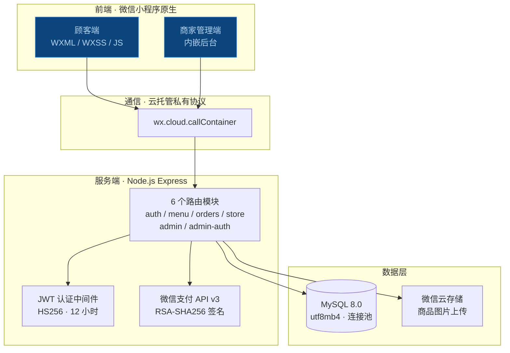

**路由安全模型**：`/api/admin/*` 全部需要 JWT 鉴权，顾客端 API 无需认证。管理员通过密码登录获取 token，前端在请求头中携带 `Authorization: Bearer <token>`。token 有效期 12 小时，过期自动清除并跳转登录页。

---

## 数据库设计

四张核心表，字段精简、职责单一。

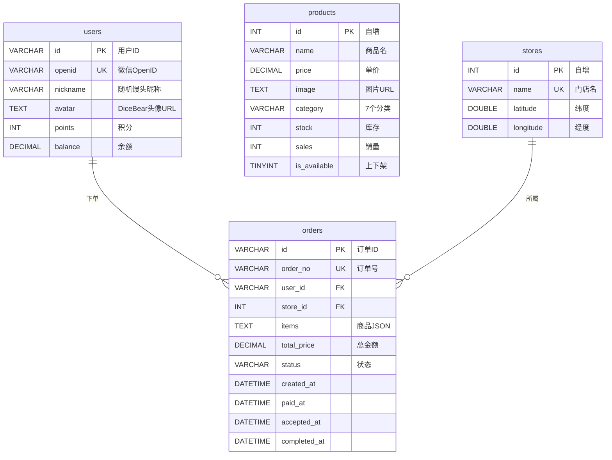

`database.js` 中实现了**自动建表 + 列迁移**：服务启动时检查表是否存在，不存在则创建；如果旧表缺少列（如 `stock`、`source`），自动 `ALTER TABLE` 补齐。`seed.js` 提供初始种子数据（1 个门店 + 1 个测试商品），开发环境一键就绪。

---

## 订单状态机

这是整个系统最核心的设计。订单在 4 种数据库状态间流转，前端映射为 5 步时间线，每一步都记录时间戳：

```
  pending ──支付──▶ preparing ──商家接单──▶ preparing ──标记可取餐──▶ ready ──取餐──▶ completed
   (创建)          (paid_at 写入)        (accepted_at 写入)      (待取餐)       (completed_at 写入)
```

| 数据库状态 | 时间线展示 | 触发动作 | 涉及接口 |
|-----------|-----------|---------|---------|
| `pending` | 订单创建 | 顾客提交订单 | `POST /api/orders` |
| `preparing` | 支付成功 | 模拟支付直接完成 / 微信回调通知 | `POST /api/pay/:orderId` |
| `preparing` | 商家接单 | 管理员点击接单 | `POST /api/orders/:id/accept` |
| `ready` | 制作完成 | 管理员标记可取餐 | `POST /api/admin/orders/:id/ready` |
| `completed` | 已取餐 | 顾客确认取餐 / 管理员标记完成 | `POST /api/orders/:id/complete` |

**支付模式智能降级**：`wechat-pay.js` 启动时检查 `WX_PAY_MCHID` 环境变量。如果商户号已配置，走完整的 API v3 流程（JSAPI 下单 → RSA-SHA256 签名 → 回调通知 → AES-256-GCM 解密）；如果未配置，自动降级为模拟支付——订单直接标记为 `preparing` 并扣减库存，前端不调用 `wx.requestPayment`。这一设计让系统在商户资质就绪前即可完整演示全流程。

---

## 顾客端界面

顾客端由 4 个 Tab 构成（首页 · 点单 · 订单 · 我的），外加门店选择页和订单确认页，共 6 个核心页面。

### 首页 & 门店选择

首页提供 Banner 展示区、门店自提 / 邮寄服务入口、活动滚动横幅。点击"门店自提"进入门店选择页——腾讯地图标记门店位置，Haversine 公式计算用户到门店的球面距离，小于 1km 以米显示，大于 1km 以公里显示。

| 首页 | 门店选择 |
|:---:|:---:|
|  | 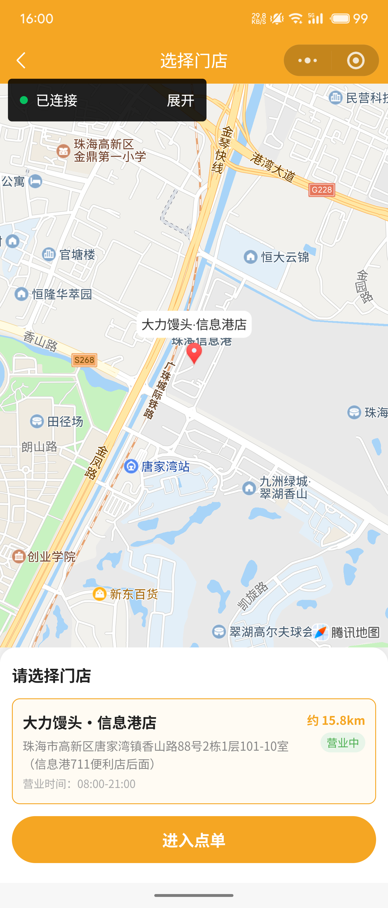 |

**Haversine 距离计算**（`backend/routes/store.js`）：前端通过 `wx.getLocation` 获取用户经纬度，作为查询参数传给 `GET /api/stores?lat=XX&lng=XX`，后端使用地球半径 6371km 计算球面距离，格式化后返回。用户未授权定位时显示"未知距离"。

### 点单 & 下单

进入点单页后，左侧显示商品分类（由 `GET /api/categories` 从数据库实时提取），右侧显示当前分类下的在售商品（`GET /api/products?category=XX`，自动过滤 `is_available=0` 和 `stock=0` 的商品）。点击加号按钮将商品加入购物车，购物车状态存储在页面 `data.cart` 对象中（`{ 商品ID: 数量 }`），底部悬浮栏实时计算总价。

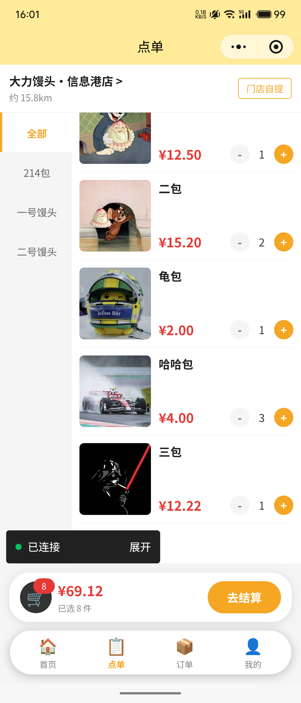

确认购物车后进入订单确认页，汇总商品清单和金额，选择微信支付后提交。这一页是顾客下单流程的最后一个确认节点：

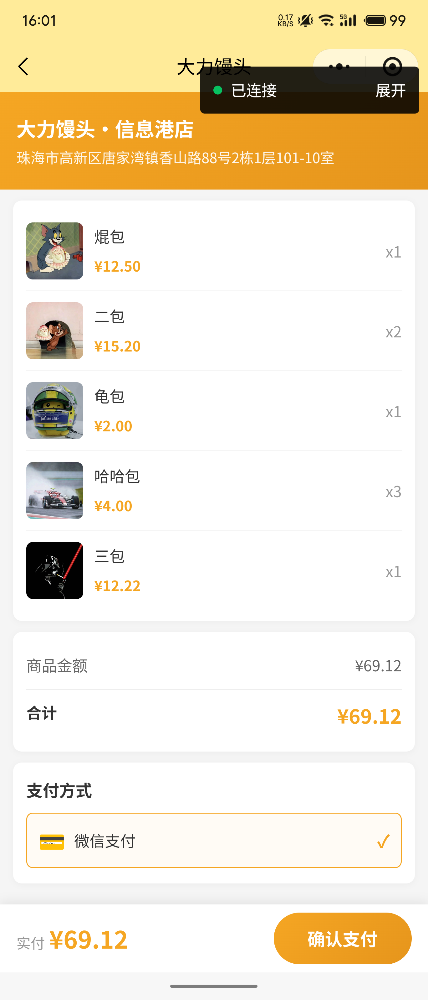

### 订单追踪

支付完成后进入订单详情页。这是最能体现前后端联动的页面——顶部展示当前状态图标，下方是 5 步时间线，已完成的步骤高亮，未完成的置灰。用户可以看到订单从创建到取餐的每一步时间。

| 支付成功 · 制作中 | 制作完成 · 待取餐 |
|:---:|:---:|
| 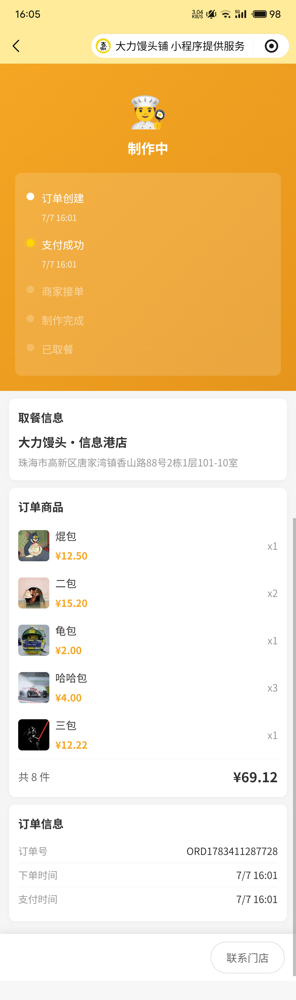 | 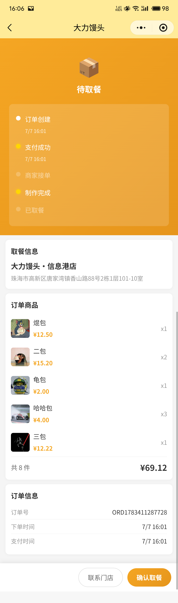 |

时间线的每一步对应一个数据库时间戳字段——`created_at`、`paid_at`、`accepted_at`、状态变为 `ready` 的时间点、`completed_at`。商家端每次操作都会触发前端轮询刷新，确保顾客看到的进度是实时的。

### 订单列表 & 个人中心

订单列表页按状态分组（全部 / 待支付 / 制作中 / 待取餐 / 已完成），支持下拉刷新。个人中心展示 DiceBear 自动生成的卡通头像、馒头主题随机昵称，以及积分 / 优惠券 / 余额资产卡片。

| 订单列表 | 个人中心 |
|:---:|:---:|
| 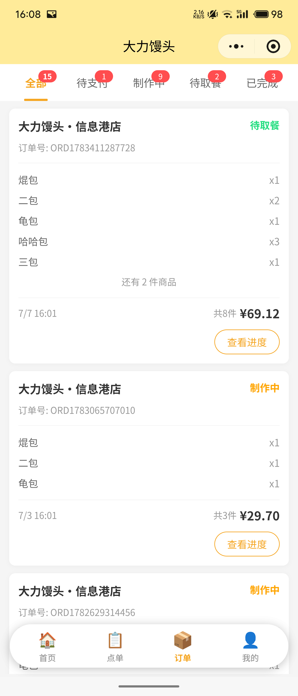 | 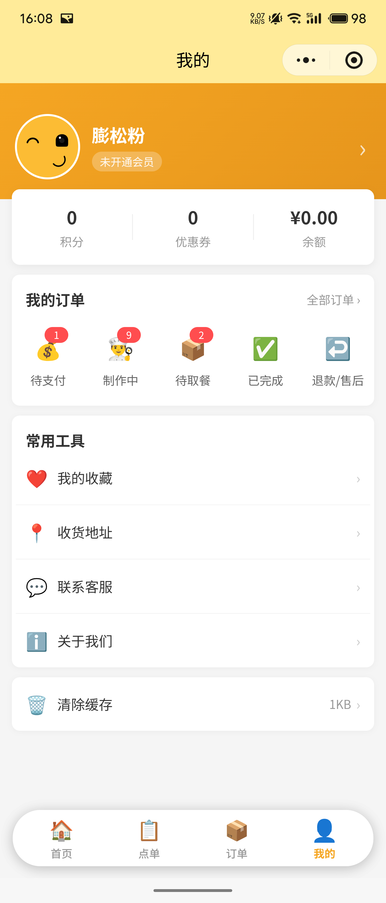 |

**用户体系**：顾客首次打开小程序时，前端调用 `wx.login` 获取临时 code，后端通过 `jscode2session` 接口换取真实 openid 作为用户唯一标识。新用户自动分配馒头主题昵称（如"馒头侠A3F"、"蒸笼客B7K"）和 DiceBear 头像。

---

## 商家管理端

商家管理端内嵌在小程序中，通过**连续点击首页 Banner 5 次**进入——这是一个隐藏入口设计，避免普通顾客误触。进入后需输入管理员密码，后端签发 JWT token，后续所有操作携带 token 鉴权。

### 订单管理

商家管理端 4 个 Tab 中最常用的模块。顶部状态筛选栏支持按 pending / preparing / ready / completed 分类查看订单。核心亮点是**实时轮询机制**——前端使用递归 `setTimeout`（而非 `setInterval`）每 5 秒调用一次 `GET /api/admin/orders`，发现新订单时自动刷新列表并触发手机震动（`wx.vibrateShort`），同时顶部显示"有 N 笔新订单"横幅。

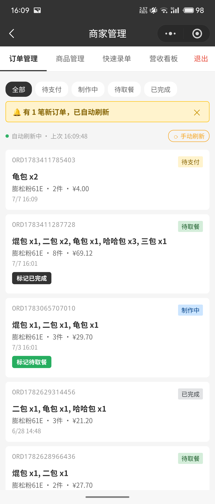

订单状态栏中的绿色圆点表示轮询正在运行，点击"手动刷新"可立即拉取最新数据。每笔订单卡片显示订单号、顾客昵称、商品清单、金额和时间，已支付的订单提供"标记待取餐"按钮。

### 商品管理

支持新增、编辑、上下架、删除商品，编辑模式下展开完整的表单（名称、价格、分类、库存）和图片上传入口。图片通过 `wx.chooseImage` 从相册选择，上传至微信云存储后返回 URL 存入数据库。

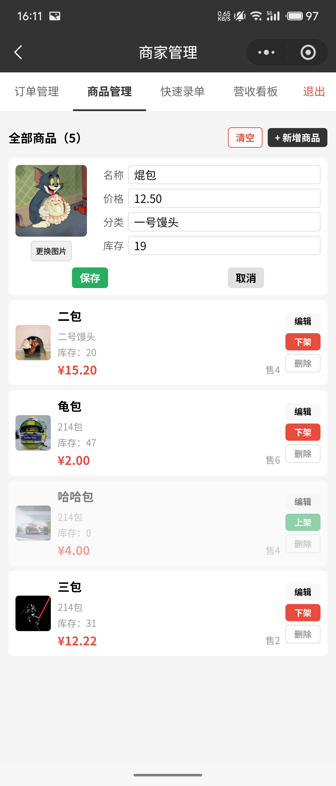

列表中的每个商品显示图片、名称、分类、价格、库存和累计销量。库存为 0 时自动下架（`is_available=0`），补货后可通过编辑重新上架。`DELETE` 操作提供"一键清空"快捷入口，方便重新初始化商品数据。

### 快速录单 & 营收看板

快速录单用于线下现金收款——店员直接选择商品和数量，系统自动生成订单号（`OFF` 前缀表示线下录单），跳过支付流程直接标记 `completed`，同时扣减库存、累加销量、计入当日营收。底部汇总栏实时计算已选件数和合计金额。

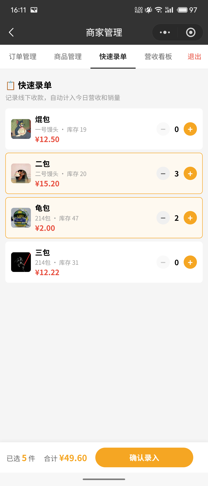

营收看板展示今日数据：营收（已支付订单总金额）、总订单数、各状态分布。数据通过 `GET /api/admin/dashboard` 实时查询当日 `created_at` 的订单聚合结果。

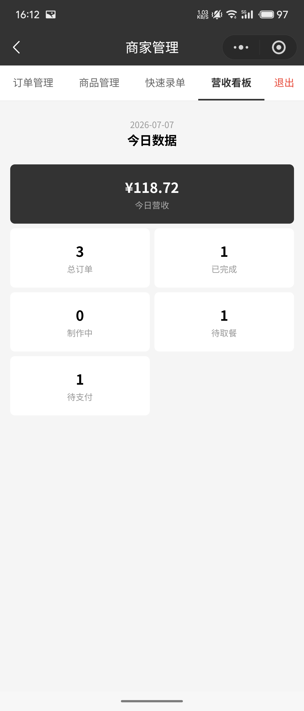

---

## 完整流程演示

### 顾客端：选店 → 加购 → 下单 → 支付 → 追踪订单


从首页选择门店 → 进入点单页浏览商品加购 → 确认订单并支付 → 跳转订单详情页查看制作进度。模拟支付模式下支付即时完成，真实支付模式下会调起微信支付收银台。

### 商家端：登录 → 查看新订单 → 标记完成 → 营收看板

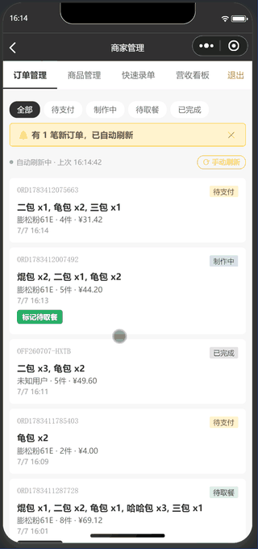

输入密码登录管理后台 → 订单列表自动刷新，新订单触发手机震动 → 标记制作完成 → 标记已取餐 → 切换营收看板查看今日数据。

---

## 本地开发

```bash
# 1. 克隆仓库
git clone https://github.com/zip-Wu/tasty_bakery.git
cd tasty_bakery

# 2. 启动后端
cd backend
npm install
cp .env.example .env
# 编辑 .env：ADMIN_PASSWORD / JWT_SECRET / DB_PASS 为必需项
node seed.js     # 初始化数据库 + 种子数据（1 门店 + 1 测试商品）
node app.js      # 启动 Express 服务（默认 80 端口）

# 3. 启动前端
# 微信开发者工具 → 导入项目 → 选择 front_UI/ 目录
# 修改 project.config.json 中的 appid 为你自己的小程序 AppID
```

**环境变量**（所有敏感信息通过 `.env` 注入，仓库不含任何明文凭据）：

| 变量 | 用途 | 是否必需 |
|------|------|:---:|
| `ADMIN_PASSWORD` | 商家后台登录密码 | 是 |
| `JWT_SECRET` | JWT 签名密钥 | 是 |
| `DB_PASS` | MySQL 密码 | 是 |
| `WX_APP_ID` / `WX_APP_SECRET` | 微信 code2session | 是 |
| `WX_PAY_MCHID` 等 6 个 | 微信支付商户凭证 | 否（缺则模拟支付） |

---

## 项目结构

```
tasty_bakery/
├── front_UI/                   # 微信小程序前端（9 页面 + 1 组件）
│   ├── app.js                  # 应用入口 · callContainer 请求封装
│   ├── app.json                # 页面路由 · 自定义悬浮 TabBar
│   ├── config.js               # 云环境 ID 与服务名
│   ├── pages/
│   │   ├── home/               # 首页（Banner + 功能入口 + 活动区）
│   │   ├── store-select/       # 门店选择（腾讯地图 + Haversine 距离）
│   │   ├── index/              # 点单（分类筛选 + 购物车）
│   │   ├── order-confirm/      # 订单确认 + 支付
│   │   ├── order-detail/       # 5 状态时间线
│   │   ├── order-list/         # 订单列表（状态 Tab + 下拉刷新）
│   │   ├── logs/               # 个人中心
│   │   ├── admin/              # 商家管理（订单/商品/录单/营收 4 Tab）
│   │   └── auth/               # 商家登录
│   └── custom-tab-bar/         # 自定义悬浮 TabBar 组件
│
├── backend/                    # Node.js 后端
│   ├── app.js                  # Express 入口 · 路由挂载 · 全局异常捕获
│   ├── database.js             # MySQL 连接池 · 自动建表 · 列迁移
│   ├── seed.js                 # 种子数据（商品 + 门店）
│   ├── Dockerfile              # 云托管容器镜像
│   ├── middleware/
│   │   └── auth.js             # JWT 签发 + Bearer Token 验证
│   ├── routes/
│   │   ├── auth.js             # 微信 code2session · 用户 CRUD
│   │   ├── menu.js             # 商品列表 · 分类提取
│   │   ├── orders.js           # 订单创建 · 支付 · 状态流转 · 模拟支付
│   │   ├── store.js            # 门店列表 · Haversine 距离计算
│   │   ├── admin.js            # 管理 API（订单/商品/录单/营收）
│   │   └── admin-auth.js       # 管理员密码验证 · JWT 签发
│   └── services/
│       └── wechat-pay.js       # 微信支付 V3 签名/下单/回调解密
│
├── screenshots/                # 界面截图与流程 GIF
└── README.md
```

---

## 查阅指南

| 你想看... | 看这个文件 |
|-----------|-----------|
| 小程序全局入口和云通信封装 | `front_UI/app.js` → `request()` |
| 页面路由和自定义 TabBar | `front_UI/app.json` + `custom-tab-bar/index.js` |
| 购物车状态管理 | `front_UI/pages/index/index.js` → `data.cart` |
| 订单 5 状态时间线渲染 | `front_UI/pages/order-detail/order-detail.wxml` |
| 商家端实时轮询 + 震动 | `front_UI/pages/admin/admin.js` → `startPolling()` |
| 数据库表结构和列迁移逻辑 | `backend/database.js` |
| JWT 签发和验证 | `backend/middleware/auth.js` |
| 微信支付签名 + 模拟支付降级 | `backend/services/wechat-pay.js` + `backend/routes/orders.js` → `processMockPayment()` |
| 订单完整生命周期 | `backend/routes/orders.js` + `backend/routes/admin.js` |
| Haversine 距离计算 | `backend/routes/store.js` → `haversine()` |
| 初始种子数据 | `backend/seed.js` |

---

## License

MIT
