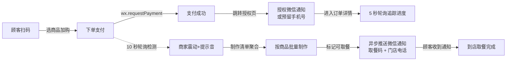
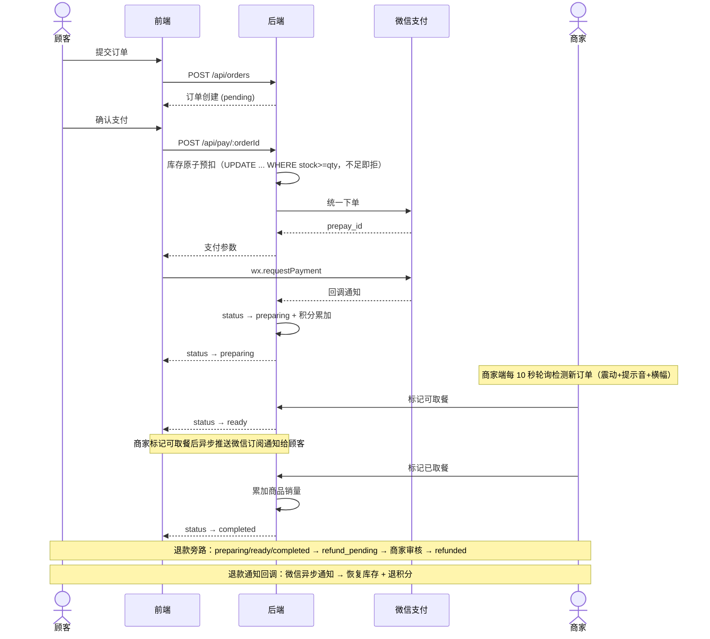
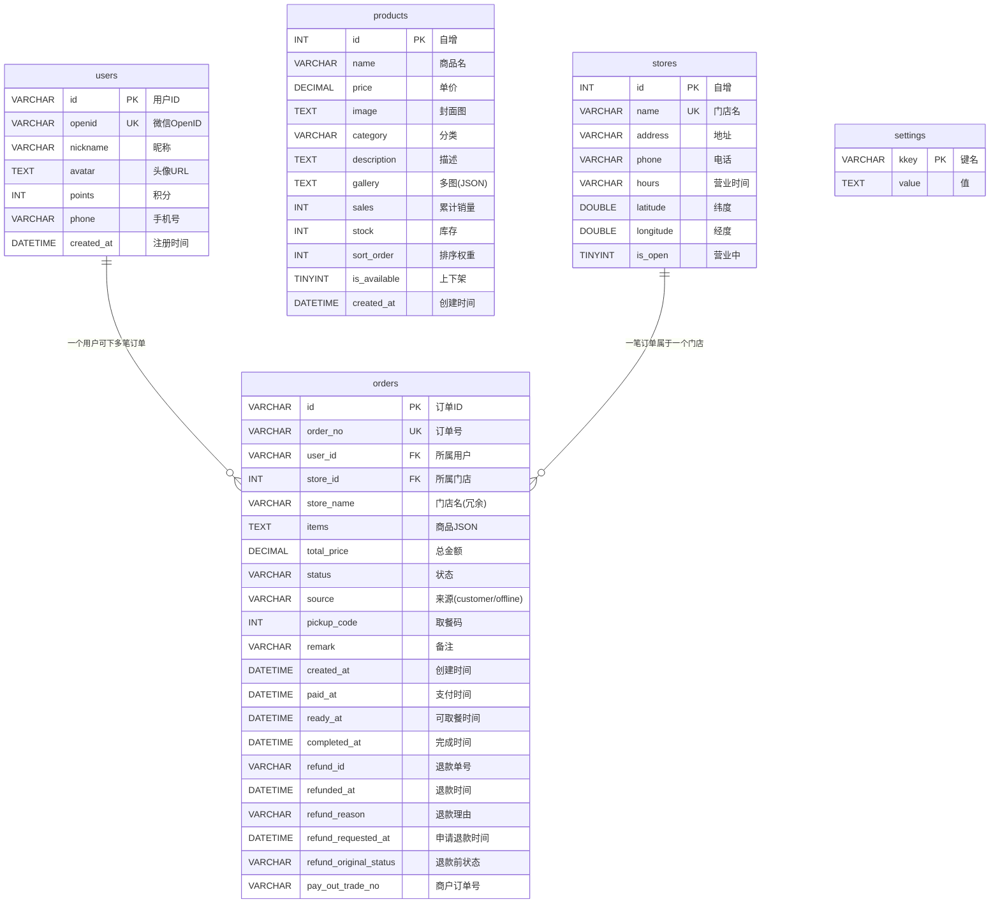

# 大力馒头铺 — 预定取餐小程序

> 为珠海「大力馒头铺·信息港店」开发的预定取餐小程序，已在门店实际使用。

[](https://developers.weixin.qq.com/miniprogram/dev/framework/)
[](https://expressjs.com/)
[](https://www.mysql.com/)
[](./LICENSE)

---

## 扫码体验

<p align="center">
  
  <br/>
  <sub>微信扫一扫，即刻体验</sub>
</p>

---

## 项目简介

顾客扫码进入小程序、选商品加购后，进入订单确认页（可填写备注），微信支付下单。支付成功后跳转到通知授权页，引导顾客授权微信订阅消息或预留手机号——之后即可在订单详情页追踪制作进度。

同一时间，商家端 10 秒轮询检测新订单，手机震动 + 播放提示音（静音模式下也会响），顶部弹出「N 笔新订单」横幅。商家在制作清单中按商品聚合查看所有待制作订单，制作完成后标记「可取餐」，系统异步推送微信服务通知给顾客（含取餐码、商品名、门店电话）。顾客凭取餐码到店取餐，订单完成。



项目包含 11 个前端页面、6 个后端路由模块、5 张数据库表。

---

## 功能一览

### 顾客端

| 功能 | 说明 |
|------|------|
| **门店选择** | 腾讯地图定位 + Haversine 公式计算球面距离，小于 1km 显示米、大于 1km 显示公里 |
| **商品浏览** | 左侧分类筛选（后端动态提取，非硬编码）、右侧商品列表，售罄商品灰显 |
| **购物车** | 页面级状态管理，切分类不丢数据，结算后自动清空 |
| **商品详情** | 轮播图 + 完整描述 + 月销量，支持从详情页直接加购 |
| **下单支付** | 订单确认后服务端按数据库真实价格重算总额，杜绝前端篡改；通过微信支付完成付款 |
| **订单追踪** | 4 步时间线（创建 → 制作 → 可取餐 → 完成），页面每 5 秒自动刷新状态，完成/退款后停止轮询 |
| **取餐通知** | 支付成功后跳转授权页，引导顾客授权微信订阅消息；商家标记可取餐时自动推送通知（含取餐码） |
| **手机号收集** | 授权页及订单详情页均可输入/修改手机号，后端校验格式 |
| **退款申请** | 已支付订单支持提交退款申请，商家审核批准后原路退回 |
| **个人中心** | 用户可自由修改头像和昵称，显示积分 |

### 商家端

| 功能 | 说明 |
|------|------|
| **实时订单提醒** | 新订单到达时手机震动 + 提示音（静音模式下也会响），顶部弹出「N 笔新订单」横幅 |
| **订单管理** | 7 种状态筛选（退款审核/全部/制作中/待取餐/已完成/待支付/已退款），显示顾客昵称、手机号、备注、取餐码 |
| **制作清单** | 待制作订单按商品聚合，按今日/昨日/前天/更早分组，显示每款商品需做份数及涉及顾客数 |
| **退款审核** | 查看退款理由 + 来源状态，批准→微信原路退款+回库存+退积分，拒绝→恢复原状态 |
| **商品管理** | 新增/编辑/上下架/删除，支持封面图及多图轮播上传至微信云存储，可调整排序 |
| **快速录单** | 线下现金收款专用，选好商品确认后自动生成 OFF 前缀订单号，直接完成并扣库存 |
| **营收看板** | 支持日/月/年三种维度切换、日期选择器回溯历史数据；今日营收、当月汇总、当年汇总、商品销量排行、订单明细 |
| **门店开关** | 一键打烊，顾客端立刻显示"已打烊"提示并拦住新下单 |

### 鉴权

顾客端和商家端采用两套独立的鉴权方案：

- **顾客端**：微信云托管网关在每次 API 请求中自动注入 `X-WX-OPENID` 头部，后端根据 openid 识别用户身份。所有涉及用户数据的接口使用内部用户 ID 而非客户端传入的 userId，防止横向越权。

- **商家端**：管理员密码登录后，后端签发 JWT（HS256 签名，12 小时有效）。同一 IP 每分钟最多 5 次登录尝试。

---

## 界面预览

### 顾客端 — 浏览与点单

| 首页 | 点单 | 门店选择 | 商品详情 | 个人中心 |
|:---:|:---:|:---:|:---:|:---:|
| <a href="./screenshots/01-首页.png" target="_blank"></a> | <a href="./screenshots/02-点单页-全部.png" target="_blank"></a> | <a href="./screenshots/05-门店列表页.jpg" target="_blank"></a> | <a href="./screenshots/06-商品详情页.png" target="_blank"></a> | <a href="./screenshots/04-我的.png" target="_blank"></a> |

*首页展示门店入口和活动区，点单页按分类筛选商品并加入购物车。点击小图可查看原始截图。*

### 顾客端 — 下单与取餐

| 确认支付 | 通知授权 | 制作中 | 待取餐 | 已完成 |
|:---:|:---:|:---:|:---:|:---:|
| <a href="./screenshots/07-支付页.png" target="_blank"></a> | <a href="./screenshots/14-通知授权页.png" target="_blank"></a> | <a href="./screenshots/08-订单详情-制作中.png" target="_blank"></a> | <a href="./screenshots/08-订单详情-待取餐.png" target="_blank"></a> | <a href="./screenshots/08-订单详情-已完成.png" target="_blank"></a> |

*完整取餐流程：确认订单 → 微信支付 → 跳转通知授权页引导顾客授权订阅消息/留手机号 → 进入订单详情页追踪进度。制作中/待取餐页面展示取餐码和通知授权入口，商家标记可取餐后推送微信通知，取餐完成时间线全亮。*

### 顾客端 — 更多视图

| 售罄分类 | 订单列表-全部 | 订单列表-制作中 | 订单列表-待取餐 | 订单列表-待支付 | 订单列表-已完成 |
|:---:|:---:|:---:|:---:|:---:|:---:|
| <a href="./screenshots/02-点单页-无库存.png" target="_blank"></a> | <a href="./screenshots/03-订单页-全部.png" target="_blank"></a> | <a href="./screenshots/03-订单页-制作中.png" target="_blank"></a> | <a href="./screenshots/03-订单页-待取餐.png" target="_blank"></a> | <a href="./screenshots/03-订单页-待支付.png" target="_blank"></a> | <a href="./screenshots/03-订单页-已完成.png" target="_blank"></a> |

*售罄分类自动聚合、订单列表多状态 Tab 切换（制作中/待取餐/待支付/已完成）。*

### 商家端 — 运营管理

| 登录 | 订单管理 | 制作清单 | 退款审核 | 商品管理 | 快速录单 | 营收(日) |
|:---:|:---:|:---:|:---:|:---:|:---:|:---:|
| <a href="./screenshots/09-商家登录页.png" target="_blank"></a> | <a href="./screenshots/10-订单管理.png" target="_blank"></a> | <a href="./screenshots/15-制作清单.png" target="_blank"></a> | <a href="./screenshots/10-订单管理-退款审核.png" target="_blank"></a> | <a href="./screenshots/11-商品管理.png" target="_blank"></a> | <a href="./screenshots/12-快速录单.png" target="_blank"></a> | <a href="./screenshots/13-营收看板-日视图.png" target="_blank"></a> |

*管理后台通过首页"加热方法"卡片连续点击 7 次进入，5 个 Tab（订单管理 / 制作清单 / 商品管理 / 快速录单 / 营收看板）。点击小图可查看原始截图。*

### 商家端 — 更多视图

| 订单管理-制作中 | 营收看板-月视图 | 商品编辑 |
|:---:|:---:|:---:|
| <a href="./screenshots/10-订单管理-制作中.png" target="_blank"></a> | <a href="./screenshots/13-营收看板-月视图.png" target="_blank"></a> | <a href="./screenshots/11-商品管理-编辑.png" target="_blank"></a> |

*订单管理支持 7 种状态筛选。营收看板支持日/月/年三维切换，月视图展示月度汇总+每日营业额+商品销量排行。*

---

## 技术实现

前端微信小程序原生框架，后端 Node.js/Express，数据库 MySQL，部署在微信云托管。支付使用云托管封装的微信支付 V2 接口。

### 订单流程



订单状态流转规则：`pending → preparing → ready → completed`，禁止跳过或回退。pending 超 30 分钟自动清理：删单前先查微信确认未支付才还库存+删单（防止误删已付款订单）；微信侧已支付但回调丢失的订单自动补转 preparing。

### 支付与库存

- 价格服务端重算：不信任客户端传入的总额，后端查数据库真实价格重新计算
- 并发防超卖：确认支付时执行 `UPDATE products SET stock = stock - ? WHERE id = ? AND stock >= ?`，检查库存和扣减是一条原子 SQL，由数据库行锁裁决，条件不满足直接拒绝，提示库存不足。扣库存放在"确认支付"而不是"下单"时——下单不等于会付钱，扣太早库存会被白白占住；也不放在"支付回调"里——两个顾客同时付款成功，只有一个人能拿到库存，另一个钱都付了只能人工处理。提前在付款前卡一道，就不会出现"收了钱没货"。
- 未支付订单清理：30 分钟没付的订单由定时器删掉，删之前先查微信确认确实没付，才还库存、删订单；如果微信那边显示已支付（回调丢了），自动补成"制作中"。顾客取消支付不会删订单，30 分钟内还能回来重新付。
- 回调幂等：支付回调里二次确认订单状态，防止并发重复处理

### 取餐通知

商家标记「可取餐」时，后端异步调用微信订阅消息 API，向顾客推送服务通知（含取餐码、商品名、门店电话）。通知发送失败不影响订单状态更新。支付成功后跳转授权页引导顾客订阅，订单详情页也保留授权入口作为兜底。

---

## 数据库

共 5 张表：



---

## 安全措施

- JWT 认证：HS256 签名，12 小时过期
- IDOR 防护：用户数据接口使用内部 ID 而非客户端传入的 userId
- 登录频率限制：管理员同一 IP 每分钟最多 5 次
- 用户隐私：前端不返回 openid，日志中 openid 做脱敏处理
- 退款审核：用户提交申请 → 商家审核 → 批准才执行退款

---

## 线上问题与复盘

**并发下单超卖（2026-08-06）**

上线后遇到一次：两个顾客同时买同一款馒头，都付了钱，但订单卡在"待支付"转不了"制作中"，日志里反复刷"库存不足"。

原因：下单时没真正锁库存，两单都能生成；支付回调里扣库存发现不够，事务回滚后微信又一直重试，于是卡死。

处理：改成在"确认支付"时直接扣库存，`UPDATE ... WHERE stock >= 数量` 不满足就当场拒绝，不让顾客付钱。未支付的订单 30 分钟后清理，删之前先问微信"这笔付了没"，付了就不删。

---

## 项目结构

```
tasty_bakery/
├── front_UI/                     # 微信小程序前端
│   ├── app.js                    # 入口 · callContainer 封装
│   ├── app.json                  # 页面路由 · 自定义 TabBar
│   ├── config.js                 # 云环境 ID
│   ├── pages/
│   │   ├── home/                 # 首页（Banner + 功能入口 + 隐藏管理后台）
│   │   ├── store-select/         # 门店选择（腾讯地图 + Haversine 距离）
│   │   ├── index/                # 点单（分类筛选 + 购物车）
│   │   ├── product-detail/       # 商品详情（轮播图 + 加购）
│   │   ├── order-confirm/        # 订单确认 + 微信支付
│   │   ├── order-detail/         # 订单追踪（4 步时间线 + 通知授权 + 退款）
│   │   ├── order-list/           # 订单列表（状态 Tab + 下拉刷新）
│   │   ├── notify-auth/          # 通知授权页（支付成功后引导授权+留手机号）
│   │   ├── logs/                 # 个人中心
│   │   ├── admin/                # 商家后台（订单/制作清单/商品/录单/营收 5 个 Tab）
│   │   └── privacy/              # 隐私政策
│   └── custom-tab-bar/           # 自定义悬浮 TabBar 组件
│
├── backend/                      # Node.js 后端
│   ├── app.js                    # Express 入口 · 路由挂载
│   ├── database.js               # MySQL 连接池 · 自动建表
│   ├── seed.js                   # 种子数据
│   ├── Dockerfile                # 容器部署配置
│   ├── middleware/
│   │   └── auth.js               # JWT 签发/验证 · requireUser
│   ├── routes/
│   │   ├── auth.js               # 微信 code2session · 用户 CRUD
│   │   ├── menu.js               # 商品列表 · 分类提取
│   │   ├── orders.js             # 订单创建 · 微信支付 · 状态流转 · 退款
│   │   ├── store.js              # 门店列表 · Haversine 距离
│   │   ├── admin.js              # 管理 API（订单/商品/录单/营收/制作清单/门店开关）
│   │   └── admin-auth.js         # 管理员登录 · 频率限制
│   └── services/
│       ├── wechat-pay.js         # 云托管微信支付封装（下单/查询/退款）
│       └── wechat-notify.js      # 微信订阅消息推送
│
└── README.md
```

---

## 快速开始

```bash
# 1. 克隆仓库
git clone https://github.com/zip-Wu/tasty_bakery.git
cd tasty_bakery

# 2. 启动后端
cd backend
npm install
cp .env.example .env   # 编辑填入 ADMIN_PASSWORD / JWT_SECRET / DB_PASS
node seed.js            # 初始化数据库 + 种子数据
node app.js             # 启动 Express（默认 80 端口）

# 3. 启动前端
# 微信开发者工具 → 导入项目 → 选择 front_UI/ 目录
# 修改 project.config.json 中的 appid
```

**环境变量**（通过 `.env` 注入）：

| 变量 | 用途 | 必需 |
|------|------|:---:|
| `ADMIN_PASSWORD` | 商家后台登录密码 | 是 |
| `JWT_SECRET` | JWT 签名密钥 | 是 |
| `DB_PASS` | MySQL 密码 | 是 |
| `WX_APP_ID` / `WX_APP_SECRET` | 微信 code2session | 是 |
| `WX_PAY_SUB_MCHID` | 微信支付子商户号 | 支付需要 |

---

## License

MIT
