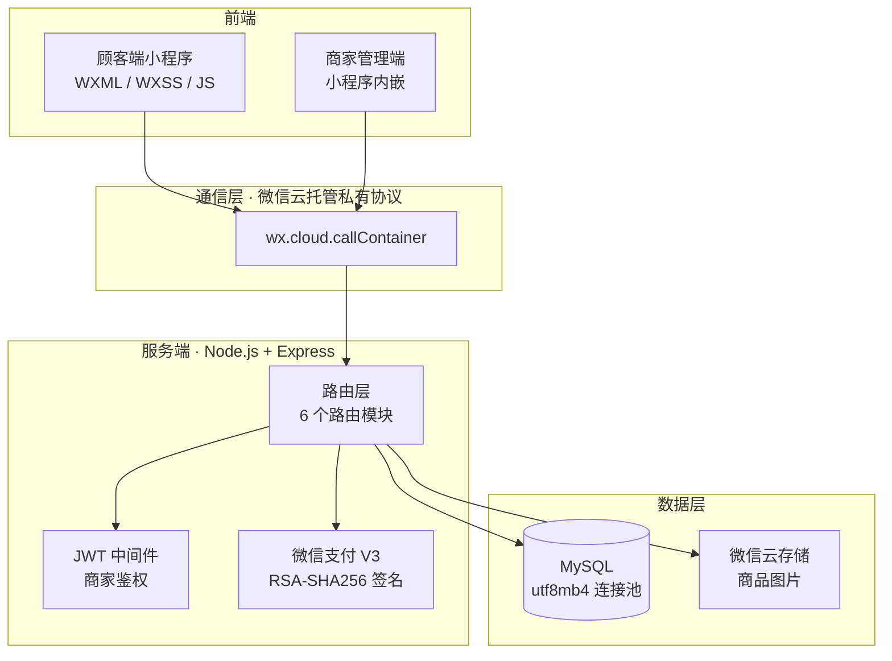
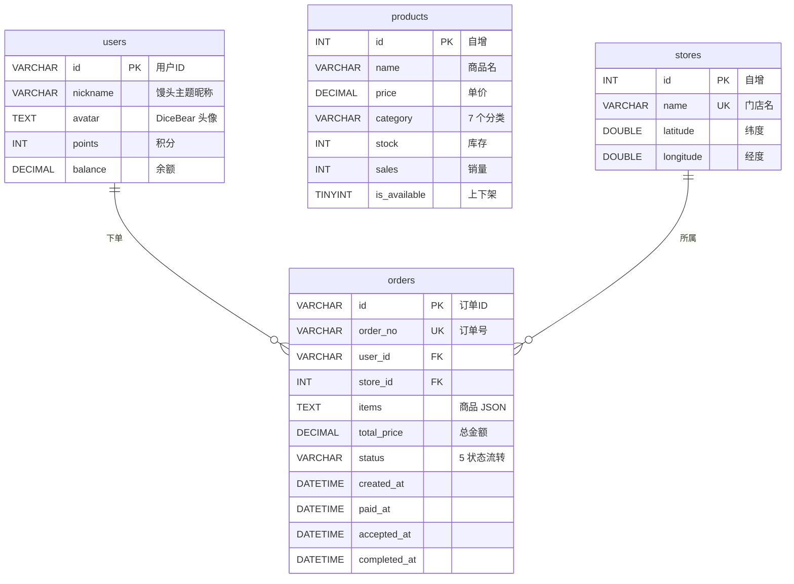

# 大力馒头 — 面包店扫码点单小程序

> **从扫码到取餐，全流程闭环** — 为珠海「大力馒头·信息港店」打造，已在门店实际使用。

[](https://developers.weixin.qq.com/miniprogram/dev/framework/)
[](https://expressjs.com/)
[](https://www.mysql.com/)
[](https://jwt.io/)
[](https://pay.weixin.qq.com/)
[](https://cloud.weixin.qq.com/)
[](./LICENSE)

A full-stack order-and-pickup system for a bakery in Zhuhai, China. Customers scan a QR code to order, the merchant receives orders in real-time on their phone. Backend deployed on WeChat Cloud Run (Docker), supporting mock payment fallback when the merchant account is pending.

---

## 目录

- [30 秒速览](#30-秒速览)
- [技术架构](#技术架构)
- [数据库设计](#数据库设计)
- [本地开发](#本地开发)
- [功能详情](#功能详情)
- [项目结构](#项目结构)
- [查阅指南](#查阅指南)
- [流程演示](#流程演示)
- [界面预览](#界面预览)

---

## 30 秒速览

```
  顾客扫码 → 选店看菜单 → 加购下单 → 支付 → 追踪订单状态
                                              ↕ 实时同步
  商家登录 → 看新订单 → 标记制作中 → 标记可取餐 → 营收看板
```

两端通过微信云托管私有协议 `callContainer` 直连同一套 Express API，订单状态变更在秒级内双向可见。

---

## 技术架构



---

## 数据库设计



---

## 本地开发

```bash
# 1. 克隆
git clone https://github.com/zip-Wu/tasty_bakery.git
cd tasty_bakery

# 2. 后端
cd backend
npm install
cp .env.example .env
# 编辑 .env：ADMIN_PASSWORD / JWT_SECRET / DB_PASS

# 3. 初始化数据库 + 种子数据
node seed.js

# 4. 启动 Express（默认 3000 端口）
node app.js

# 5. 前端 — 微信开发者工具打开 front_UI/ 目录
#    修改 project.config.json 中的 appid
```

**环境变量**（`.env` 已 `.gitignore`）：

| 变量 | 用途 |
|------|------|
| `ADMIN_PASSWORD` | 商家后台登录密码 |
| `JWT_SECRET` | JWT 签名密钥 |
| `DB_PASS` | MySQL 密码 |
| `WX_PAY_*` | 微信支付商户凭证 |

---

## 功能详情

### 顾客端（4 Tab：首页 · 点单 · 订单 · 我的）

| 模块 | 说明 |
|------|------|
| 门店选择 | 腾讯地图标记门店，Haversine 公式实时计算距离，显示营业状态 |
| 商品浏览 | 左分类右商品经典布局，7 个分类筛选，占位图模式下功能完整可用 |
| 购物车 | 底部悬浮胶囊设计，加减数量实时算总价 |
| 下单支付 | 微信支付 API v3；商户号未开通时自动降级为模拟支付，不调 `wx.requestPayment` |
| 订单追踪 | 5 状态时间线：创建 → 支付 → 接单 → 制作完成 → 取餐，每步带时间戳 |
| 用户体系 | 微信静默登录，DiceBear 自动生成卡通头像，馒头主题随机昵称 |

### 商家端（小程序内嵌，连续点击首页 Banner 5 次进入）

| 模块 | 说明 |
|------|------|
| 订单管理 | 按状态筛选，一键标记「可取餐」/「已完成」 |
| 实时轮询 | 递归 `setTimeout`，新订单自动刷新 + 手机震动提醒 |
| 商品管理 | 新增 / 编辑 / 上下架 / 删除，支持拍照上传图片 |
| 快速录单 | 线下收款直接录入系统，自动扣减库存、计入营收 |
| 营收看板 | 今日营收、订单总数、各状态分布 |

### 安全措施

- 商家 API 全部经由 JWT 中间件鉴权
- 密码、密钥、数据库凭据均通过 `.env` 注入，仓库不含任何明文凭据
- Token 过期自动清除并跳转登录页

---

## 项目结构

```
tasty_bakery/
├── front_UI/                   # 微信小程序前端（9 页面 + 1 组件）
│   ├── app.js                  # 应用入口 · callContainer 封装
│   ├── app.json                # 页面路由 · 自定义 TabBar
│   ├── config.js               # 云环境 ID
│   ├── pages/
│   │   ├── home/               # 首页（Banner + 功能入口）
│   │   ├── store-select/       # 门店选择（地图 + 距离）
│   │   ├── index/              # 点单（分类 + 购物车）
│   │   ├── order-confirm/      # 订单确认 + 支付
│   │   ├── order-detail/       # 5 状态时间线
│   │   ├── order-list/         # 订单列表（状态 Tab）
│   │   ├── logs/               # 个人中心
│   │   ├── admin/              # 商家管理（4 个 Tab）
│   │   └── auth/               # 商家登录
│   └── custom-tab-bar/         # 自定义悬浮 TabBar
│
├── backend/                    # Node.js 后端
│   ├── app.js                  # Express 入口 · 路由挂载
│   ├── database.js             # MySQL 连接池 · 自动建表 · 列迁移
│   ├── seed.js                 # 种子数据（商品 + 门店）
│   ├── Dockerfile              # 云托管容器镜像
│   ├── middleware/
│   │   └── auth.js             # JWT 认证中间件
│   ├── routes/
│   │   ├── auth.js             # 微信登录 / 用户信息
│   │   ├── menu.js             # 商品列表 / 分类
│   │   ├── orders.js           # 订单 CRUD / 支付
│   │   ├── store.js            # 门店列表（含 Haversine）
│   │   ├── admin.js            # 商家管理 API
│   │   └── admin-auth.js       # 管理员登录
│   └── services/
│       └── wechat-pay.js       # 微信支付 V3 封装
│
├── screenshots/                # 界面截图 & 流程 GIF
└── README.md
```

---

## 查阅指南

| 你想知道... | 看这个文件 |
|-------------|-----------|
| 小程序全局入口和云通信 | `front_UI/app.js` |
| 页面路由和 TabBar | `front_UI/app.json` |
| 自定义悬浮 TabBar 怎么做的 | `front_UI/custom-tab-bar/index.js` |
| 购物车状态怎么管理的 | `front_UI/pages/index/index.js` → `cart` |
| 订单 5 状态时间线逻辑 | `front_UI/pages/order-detail/order-detail.js` |
| 商家端实时轮询和震动 | `front_UI/pages/admin/admin.js` → `startPolling()` |
| 数据库表结构和列迁移 | `backend/database.js` |
| JWT 中间件怎么写的 | `backend/middleware/auth.js` |
| 微信支付签名和模拟降级 | `backend/services/wechat-pay.js` |
| 订单创建 / 支付 / 状态全流程 | `backend/routes/orders.js` |
| Haversine 距离计算 | `backend/routes/store.js` |
| 初始种子数据 | `backend/seed.js` |

---

## 流程演示

> 以下 GIF 展示了完整的下单 → 支付 → 接单 → 取餐闭环。点击展开查看。

<details>
<summary><b>顾客下单全流程</b>（选店 → 加购 → 支付 → 追踪订单）</summary>


</details>

<details>
<summary><b>商家接单处理</b>（登录 → 查看订单 → 标记完成 → 营收看板）</summary>


</details>

---

## 界面预览

> 点击展开查看全部功能界面截图。以下截图均在微信开发者工具模拟器中截取。

<details>
<summary><b>顾客端截图</b>（7 张）</summary>

| 首页 | 门店选择 |
|:---:|:---:|
|  |  |

| 点单（购物车已选 3 件） | 订单确认 + 支付 |
|:---:|:---:|
|  |  |

**订单状态时间线**

| 支付成功 · 准备中 | 制作完成 · 待取餐 |
|:---:|:---:|
|  |  |

| 订单列表 | 个人中心 |
|:---:|:---:|
|  |  |

</details>

<details>
<summary><b>商家端截图</b>（4 张）</summary>

| 订单管理（实时轮询 + 状态筛选） | 商品管理（增删改 + 上下架） |
|:---:|:---:|
|  |  |

| 快速录单（线下收款录入） | 营收看板 |
|:---:|:---:|
|  |  |

</details>

---

## License

MIT
